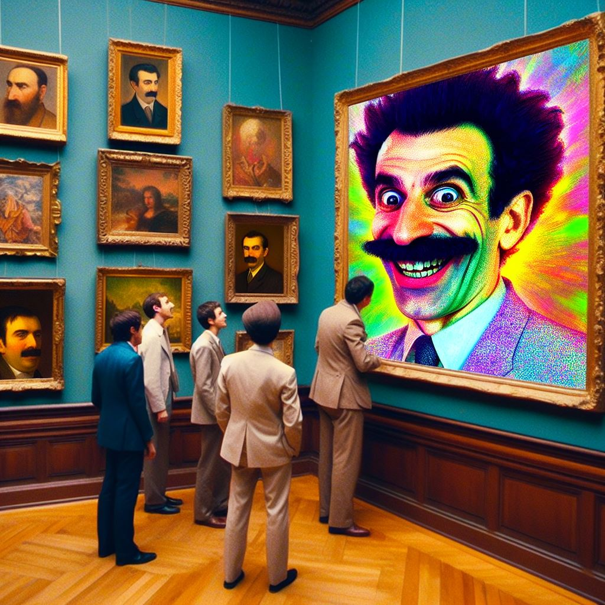
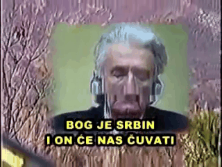

This is a Python program to produce images or videos.

It extracts random (or sequential) frames from a video or image.

It (optionally) places words somewhere on each frame.

Then joins all frames into an animation or image.

You can use many arguments to produce different kinds of results.

---

## Why?

It might be useful in the realm of human verification.


And memes.

---

## Index
1. [Installation](#installation)
1. [Usage](#usage)
1. [Arguments](#arguments)
1. [More](#more)

---


---

## Installation <a name="installation"></a>

Clone this repo, and get inside the directory:

```shell
git clone --depth 1 this_repo_url

cd gifmaker
```

Then create the virtual env:

```shell
python -m venv venv
```

Then install the dependencies:

```shell
venv/bin/pip install -r requirements.txt
```

Or simply run `scripts/venv.sh` to create the virtual env and install the dependencies.

There's a `scripts/test.sh` file that runs the program with some arguments to test if things are working properly.

There's a `scripts/install.sh` file that adds a bash script at `/usr/bin/gifmaker` so you can run it easily.

---


---

## Usage <a name="usage"></a>

Run `src/main.py` using the Python in the virtual env:

```shell
venv/bin/python src/main.py
```

Or set it up so you can simply use `gifmaker`.

(Check `scripts/install.sh` or make an alias)

You can provide a video or image path using the `--input` argument:

```shell
gifmaker --input "/path/to/video.webm"
gifmaker --input "/path/to/animated.gif"
gifmaker --input "/path/to/image.png"
```

`webm`, `mp4`, `gif`, `jpg`, and `png` should work, and maybe other formats.

You can pass it a string of lines to use on each frame.

They are separated by `;` (semicolons).

```shell
gifmaker --words "Hello Brother ; Construct Additional Pylons"
```

It will make 2 frames, one per line.

If you want to use words and have some frames without them simply use more `;`.

---

You can use random words with `[random]`:

```shell
gifmaker --words "I Like [random] and [random]"
```

It will pick random words from a list of English words.

There are 3 kinds of random formats: `[random]`, `[RANDOM]`, and `[Random]`.

The replaced word will use the case of those.

For example `[RANDOM]` might be `PLANET`.

You can specify how many random words to generate by using a number:

For example `[Random 3]` might generate `Drivers Say Stories`.

---

You can multiply random commands by using numbers like `[x2]`.

For example:

```
--words "Buy [Random] [x2]"
```

This might produce: `Buy Sink ; Buy Plane`.

The multipliers need to be at the end of the line.

---

You can also generate random numbers with `[number]`.

This is a single digit from `0` to `9`.

For example, `[number]` might result in `3`.

You can specify the length of the number.

For example, `[number 3]` might result in `128`.

You can also use a number range.

For example, `[number 0-10]` will pick a random number from `0` to `10`.

```sh
--words "I rate it [number 0-10] out of 10"
```

---

If you want to repeat the previous line, use `[repeat]`:

For example: `--words "Buy Buttcoin ; [repeat]"`.

It will use that text in the first two frames.

You can also provide a number to specify how many times to repeat:

For example: `--words "Buy Buttcoin ; [repeat 2]"`.

The line will be shown in 3 frames (the original plus the 2 repeats).

---

You can use linebreaks with `\n`.

For example: `--words "Hello \n World"`.

Will place `Hello` where a normal line would be.

And then place `World` underneath it.

---

Another way to define an empty line is using `[empty]`.

For example: `hello ; world ; [empty]`.

This could be useful in `wordfile` to add empty lines at the end.

Else you can just add more `;` to `words`.

You can also use numbers like `[empty 3]`.

That would add 3 empty frames.

---

There's also `[date]` which can be used to print dates.

You can define any date format in it.

For example `[date %Y-%m-%d]` would print year-month-day.

You can see all format codes here: [datetime docs](https://docs.python.org/3/library/datetime.html#strftime-and-strptime-format-codes).

If no format is used it defaults to `%H:%M:%S`.

---

There's also `[count]`.

The count starts at `0` and is increased on every `[count]`.

For example `--words "Match: [count] ; Nothing ; Match [count]"`.

It would print `Match: 1`, `Nothing`, and `Match: 2`.

You might want to print the count on every frame:

```ssh
--words "[count] ; [repeat 9]" --bottom 0 --right 0
```

---

You can run `main.py` from anywhere in your system using its virtual env.

Relative paths should work fine.

---

Here's a fuller example:

```shell
gifmaker --input "/videos/stuff.webm" --fontsize 18 --delay 300 --width 600 --words "I want to eat ;; [Random] ; [repeat 2] ;" --format mp4 --bgcolor 0,0,0 --output "stuff/videos"
```

---


---

## Arguments <a name="arguments"></a>

You can use arguments like: `--delay 350 --width 500 --order normal`.

These modify how the file is going to be generated.

---

> **input** (Type: str | Default: The included video)

Path to a video or image to use as the source of the frames.

`webm`, `mp4`, `gif`, and even `jpg` or `png` should work.

For example: `--input stuff/cow.webm`.

It's possible to use multiple input files by separating them with commas.

For example: `--input /some/path/1.gif,/some/other/path/2.mp4,/another/one/3.png`.

If multiple inputs, one is selected randomly as the source of the frames.

`-i` is a shorter alias for this.

---

> **output** (Type: str | Default: The output directory)

Directory path to save the generated file.

For example: `stuff/videos`.

It will use a random file name.

Using `gif`, `webm`, `mp4`, `jpg`, or `png` depending on the `format` argument.

Or you can enter the path plus the file name.

For example: `stuff/videos/cat.gif`.

The format is deduced by the extension (`gif`, `webm`, `mp4`, `jpg`, or `png`).

`-o` is a shorter alias for this.

---

> **words** (Type: str | Default: Empty)

The words string to use.

Lines are separated by `;`.

Each line is a frame.

Special words include `[random]` and `[repeat]`.

As described in [Usage](#usage).

---

> **wordfile** (Type: str | Default: None)

File to use as the source of word lines.

For example, a file can be like:

```
This is a line
I am a [random]

This is a line after an empty line
[repeat]
[empty]
```

Then you can point to it like:

```
--wordfile "/path/to/words.txt"
```

It will use word lines the same as with `--words`.

---

> **fillwords** (Type: flag | Default: False)

Fill the rest of the frames with the last word line.

If there are no more lines to use, it will re-use the last line.

You can do like:

```
--words "Single Line" --frames 5 --fillwords
```

And it will use that line in all 5 frames.

---

> **separator** (Type: str | Default: ";")

The character to use as the line separator in `words`.

This also affects `randomlist`.

---

> **delay** (Type: int | Default: 600)

The delay between frames. In milliseconds.

A smaller `delay` = A faster animation.

---

> **frames** (Type: int | Default: 3)

The amount of frames to use.

This value has a higher priority than the other frame count methods.

---

> **framelist** (Type: str | Default: Empty)

The specific list of frame indices to use.

The first frame starts at `0`.

For example `--framelist "2,5,2,0,3"`.

It will use those specific frames.

It also defines how long the animation is.

---

> **left** (Type: int | Default: None)

Padding from the left edge to position the text.

---

> **right** (Type: int | Default: None)

Padding from the right edge to position the text.

---

> **top** (Type: int | Default: None)

Padding from the top edge to position the text.

---

> **bottom** (Type: int | Default: None)

Padding from the bottom edge to position the text.

---

You only need to set `left` or `right`, not both.

You only need to set `top` or `bottom`, not both.

If those are not set then the text is placed at the center.

If any of those is set to a negative value like `-100`, it will apply it from the center.

For example: `--top -100` would pull it a bit to the top from the center.

And `--right -100` would pull it a bit to the right from the center.

---

> **width** (Type: int | Default: None)

Fixed width of every frame.

If the height is not defined it will use an automatic one.

---

> **height** (Type: int | Default: None)

Fixed height of every frame.

If the width is not defined it will use an automatic one.

---

> **nogrow** (Type: flag | Default: False)

If this is enabled, the frames won't be resized if they'd be bigger than the original.

For instance, if the original has a width of `500` and you set `--width 600`.

It's a way to limit the values of `--width` and `--height`.

---

> **format** (Type: str | Default: "gif")

The format of the output file. Either `gif`, `webm`, `mp4`, `jpg`, or `png`.

This is only used when the output is not a direct file path.

For instance, if the output ends with `cat.gif` it will use `gif`.

If the output is a directory it will use a random name with the appropriate format.

---

> **order** (Type: str | Default: "random")

The order used to extract the frames.

Either `random` or `normal`.

`random` picks frames randomly.

`normal` picks frames in order starting from the first one.

`normal` loops back to the first frame if needed.

---

> **font** (Type: str | Default "simple")

The font to use for the text.

Either `sans`, `serif`, `mono`, `bold`, or `italic`.

---

> **fontsize** (Type: int | Default: 50)

The size of the text.

---

> **fontcolor** (Type: str | Default: "255,255,255")

The color of the text.

3 numbers from `0` to `255`, separated by commas.

`0,0,0` would be black, for instance.

It uses the `RGB` format.

The value can also be `light` or `dark`.

These will get a random light or dark color.

The value can also be `light2` or `dark2`.

These will get a random light or dark color on each frame.

Names are also supported, like `green`, `black`, `red`.

---

> **bgcolor** (Type: str | Default: None)

Add a background rectangle below the text.

In case you want to give the text more contrast.

3 numbers from `0` to `255`, separated by commas.

`0,0,0` would be black, for instance.

It uses the `RGB` format.

The value can also be `random_light` or `random_dark`.

These will get a random light or dark color.

The value can also be `random_light2` or `random_dark2`.

These will get a random light or dark color on each frame.

Names are also supported, like `green`, `black`, `red`.

---

> **opacity** (Type: float | Default: 0.6)

From `0` to `1`.

The opacity level of the background rectangle.

The closer it is to `0` the more transparent it is.

---

> **padding** (Type: int | Default: 20)

The padding of the background rectangle.

This gives some spacing around the text.

This also sets the margin for `left`, `right`, `top`, and `bottom`.

---

> **radius** (Type: int | Default: 0)

The border radius of the background rectangle.

This is to give the rectangle rounded corners.

---

> **align** (Type: str | Default: "center")

How to align the center when there are multiple lines.

Either `left`, `center`, or `right`.

---
> **randomlist** (Type: str | Default: Empty)

Random words are selected from this list.

If the list is empty it will be filled with a long list of nouns.

You can specify the words to consider, separated by semicolons.

For example: `--randomlist "cat ; dog ; nice cow ; big horse"`.

---

> **randomfile** (Type: str | Default: List of nouns)

Path to a text file with the random words to use.

This is a simple text file with each word or phrase in its own line.

For example:

```
dog
a cow
horse
```

Then you point to it: `--randomfile "/path/to/animals.txt"`.

---

> **repeatrandom** (Type: flag | Default: False)

If this is enabled, random words can be repeated at any time.

Else it will cycle through them randomly without repetitions.

---

> **loop** (Type: int | Default 0)

How to loop gif renders.

`-1` = No loop

`0` = Infinite loop

`1 or more` = Specific number of loops

---

> **filter** (Type: str | Default: "none")

A color filter that is applied to each frame.

The filters are: `hue1`, `hue2` .. up to `hue8`, and `anyhue`, `anyhue2`.

And also: `gray`, `blur`, `invert`, `random`, `random2`, `none`.

`random` picks a random filter for all frames.

`random2` picks a random filter on every frame.

`anyhue` is like `random` but limited to the hue effects.

`anyhue2` is like `random2` but is limited to the hue effects.

---

> **filteropts** (Type: str | Default: Empty)

This defines the pool of available filters to pick randomly.

This applies when `filter` is `random` or `random2`.

For example: `--filteropts "hue1,hue2,hue3,gray"`.

---

> **repeatfilter** (Type: flag | Default: False)

If this is enabled, random filters can be repeated at any time.

Else it will cycle through them randomly without repetitions.

---

> **remake** (Type: flag | Default: False)

Use this if you only want to re-render the frames.

It re-uses all the frames, resizes, and renders again.

It doesn't do the rest of the operations.

For example: `--input "/path/to/file.gif" --remake --width 500 --delay 300`.

For instance, you can use this to change the `width` or `delay` of a rendered file.

---

If a number argument has a default you can use `p` and `m` operators.

`p` means `plus` while `m` means `minus`.

For example, since `fontsize` has a default of `20`.

You can do `--fontsize p1` or `--fontsize m1`.

To get `21` or `19`.

---



---

## More Information<a name="more"></a>

### Scripts

You can make `TOML` files that define the arguments to use.

Provide the path of a script like this: `--script "/path/to/script.toml"`.

For example, a script can look like this:

```toml
words = "Disregard [Random] ; [repeat] ; Acquire [Random] ; [repeat] ;"
fontcolor = "44,80,200"
bgcolor = "0,0,0"
bottom = 0
right = 0
```

---

### Functions

You can write shell functions to make things faster by using templates.

For example here's a `fish` function:

```js
function funstuff
	gifmaker \
	--input "/path/to/some/file.png" --words "$argv is [Random] [x5]" \
	--bgcolor random_dark2 --fontcolor random_light2 \
	--top 0 --fontsize 22 --filter random2 --width 600
end
```

This is added in `~/.config/fish/config.fish`.

Source the config after adding the function:

```shell
source ~/.config/fish/config.fish
```

Then you can run: `funstuff Grog`.

In this case it will do `Grogg is [Random]` 5 times.

Using all the other arguments that are specific to look good on that image.

---

### Python

You might want to interface through another Python program.

Here's some snippet that might help:

```python
gifmaker = "/path/to/gifmaker"
gm_common = "--font bold --width 555 --nogrow --output /tmp/gifmaker"

# You can have multiple functions like this
def generate_something(who):
	command = [
		gifmaker,
		gm_common,
		f"--input 'source.jpg'",
		f"--words '{who} is [Random] [x5]' --bgcolor 0,0,0",
		"--top 0 --fontsize 22 --filter random2",
	]

	run_gifmaker(command)

def run_gifmaker(command):
	cmd = " ".join(command)
	# Execute the command
	# Do something with the file
	# Maybe upload it somewhere
```