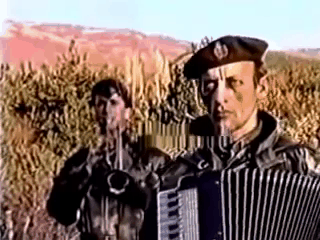

This is a Python program to produce gif images or videos.

It extracts random (or sequential) frames from a video or image.

It (optionally) places words somewhere on each frame.

Then joins all frames into an animated `gif` or `mp4`.

You can use many arguments to produce different kinds of animations.

---

## Why?

It might be useful in the realm of human verification.


And memes.

---

## Index
1. [Installation](#installation)
1. [Usage](#usage)
1. [Arguments](#arguments)

---



---

## Installation <a name="installation"></a>

Clone this repo, and get inside the directory:

```shell
git clone --depth=1 https://github.com/madprops/borat

cd borat
```

Then create the virtual env:

```shell
python -m venv venv
```

Then install the dependencies:

```shell
venv/bin/pip install -r requirements.txt
```

Or simply run `scripts/install.sh` to create the virtual env and install the dependencies.

There's a `scripts/test.sh` file that runs the program with some arguments to test if things are working properly.

---


---

## Usage <a name="usage"></a>

Run `src/borat.py` using the Python in the virtual env:

```shell
venv/bin/python src/borat.py
```

You can provide a video or image path using the `--input` argument:

```shell
venv/bin/python src/borat.py --input"/path/to/video.webm"
venv/bin/python src/borat.py --input="/path/to/animated.gif"
venv/bin/python src/borat.py --input="/path/to/image.png"
```

`webm`, `mp4`, `gif`, `jpg`, and `png` should work, and maybe other formats.

You can pass it a string of lines to use on each frame.

They are separated by `;` (semicolons).

```shell
venv/bin/python src/borat.py --words="Hello Brother ; Construct Additional Pylons"
```

It will make 2 frames, one per line.

If you want to use words and have some frames without them simply use more `;`.

---

You can use random words with `[random]`:

```shell
venv/bin/python src/borat.py --words="I Like [random] and [random]"
```

It will pick random words from a list of English words.

There are 3 kinds of random formats: `[random]`, `[RANDOM]`, and `[Random]`.

The replaced word will use the case of those.

For example `[RANDOM]` might be `PLANET`.

You can specify how many random words to generate by using a number:

For example `[Random 3]` might generate `Drivers Say Stories`.

---

If you want to repeat the previous line, use `[repeat]`:

For example `--words="Buy Buttcoin ; [repeat]"`

It will use that text in the first two frames.

You can also provide a number to specify how many times to repeat:

For example `--words="Buy Buttcoin ; [repeat 2]"`

The line will be shown in 3 frames (the original plus the 2 repeats).

---

You can use linebreaks with `\n`.

For example: `--words="Hello \n World"`

Will place `Hello` where a normal line would be.

And then place `World` underneath it.

You can control the spacing with the `linespace` argument.

---

You can run `borat.py` from anywhere in your system using its virtual env.

Relative paths should work fine.

---

Here's a fuller example:

```shell
venv/bin/python src/borat.py --input="/videos/stuff.webm" --fontsize=2.8 --delay=300 --width=600 --words="I want to eat ;; [Random] ; [repeat 2] ;" --format=mp4 --bgcolor=0,0,0 --baseline --output="stuff/videos"
```

---


---

## Arguments <a name="arguments"></a>

You can use arguments like: `--delay=350 --width=500 --order=normal`

These modify how the file is going to be generated.

---

> input = Type: str | Default: The included example video

Path to a video or image to use as the source of the frames.

`webm`, `mp4`, `gif`, and even `jpg` or `png` should work.

For example: `--input=stuff/cow.mp4`

It's possible to use multiple input files by separating them with semicolons.

For example: `--input=/some/path/1.gif ; /some/other/path/2.mp4 ; /another/one/3.png`

If multiple inputs, one is selected randomly as the source of the frames.

`-i` is a shorter alias for this.

---

> output = Type: str | Default: The borat/output directory

Directory path to save the generated file.

For example: `stuff/videos`

It will use a random file name.

Using `gif` or `mp4` depending on the `format` argument.

Or you can enter the path plus the file name.

For example: `stuff/videos/cat.gif`

The format is deduced by the extension (`gif` or `mp4`).

`-o` is a shorter alias for this.

---

> words = Type: str | Default: No words

The words string to use.

Lines are separated by `;`.

Each line is a frame.

Special words include `[random]` and `[repeat]`.

As described in [Usage](#usage).

---

> delay = Type: int | Default: 500

The delay between frames. In milliseconds.

A smaller `delay` = A faster gif.

---

> frames = Type: int | Default: 3

The amount of frames to use.

This value has higher priority than the other frame count methods.

---

> left = Type: int | Default: None

Padding from the left edge to position the text.

---

> right = Type: int | Default: None

Padding from the right edge to position the text.

---

> top = Type: int | Default: None

Padding from the top edge to position the text.

---

> bottom = Type: int | Default: None

Padding from the bottom edge to position the text.

---

You only need to set `left` or `right`, not both.

You only need to set `top` or `bottom`, not both.

If those are not set then the text is placed at the center.

If any of those is set to a negative value like `-100`, it will apply it from the center.

For example: `--top=-100` would pull it a bit to the top from the center.

And `--right=-100` would pull it a bit to the right from the center.

---

> width = Type: int | Default: None

Fixed width to every frame. Height is always automatic.

---

> format = Type: str | Default: "gif"

The format of the output file. Either `gif` or `mp4`.

This is only used when the output is not a direct file path.

For instance, if the output ends with `cat.gif` it will use `gif`.

If the output is a directory it will use a random name with the appropriate format.

---

> separator = Type: str | Default: ";"

The character to use as the line separator in `words`.

---

> order = Type: str | Default: "random"

The order used to extract the frames.

Either `random` or `normal`.

`random` picks frames randomly.

`normal` picks frames in order starting from the first one.

`normal` loops back to the first frame if needed.

---

> font = Type: str | Default "simple"

The font to use for the text.

Either `simple`, `complex`, `plain`, `duplex`, or `triplex`.

---

> fontsize = Type: float | Default: 2.5

The size of the text.

The number acts as a scale, not exact pixels.

---

> fontcolor = Type: str | Default: "255,255,255"

The color of the text.

3 numbers from `0` to `255`, separated by commas.

`0,0,0` would be black, for instance.

---

> boldness = Type: int | Default: 3

The thickness of the text.

The bigger the number, the fatter the text is.

---

> bgcolor = Type: str | Default: None

Add a background rectangle below the text.

In case you want to give the text more contrast.

3 numbers from `0` to `255`, separated by commas.

`0,0,0` would be black, for instance.

---

> opacity = Type: float | Default: 0.5

From `0` to `1`.

The opacity level of the background rectangle.

The closer it is to `0` the more transparent it is.

---

> padding = Type: int | Default: 10

The padding of the background rectangle.

This gives some spacing around the text.

---

> baseline = Type: flag | Default: False

Use this to add the baseline to the background rectangle's height.

The baseline is the room reserved for letters that have descenders, like the bottom half of `y`.

If you enable it the rectangle will cover all possible letters.

---

> wordlist = Type: str | Default: Empty

Random words are selected from this list.

If the list is empty it will be filled with a long list of nouns.

You can specify the words to consider, separated by semicolons.

Like: `--wordlist="cat; dog; nice cow; big horse"`

---

> wordfile = Type: str | Default: List of nouns

Path to a text file with the random words to use.

This is a simple text file with each word or phrase in their own line.

For example:

```
dog
a cow
horse
```

Then you point to it: `--wordfile="/path/to/animals.txt"`

---

> loop = Type: int | Default 0

How to loop the gifs.

`-1` = No loop

`0` = Infinite loop

`1 or more` = Specific number of loops

---

> linespace = Type: int | Default 20

Spacing between lines separated by `\n`.

---

> linebreak = Type: str | Default: "\n"

The character to use for linebreaks.

---

> filter = Type: str | Default: None

A color filter to apply to each frame.

Either: `hue1`, `hue2`, `hue3`, `hue4`, `hue5`, `hue6`, `hue7`, `hue8`

And: `gray`, `blur`, `invert`, `saturate`, `random`, `random2`

`random` picks a random filter for all frames.

`random2` picks a random filter on every frame.

---

> remake = Type: flag | Default: False

Use this if you only want to re-render the frames.

It re-uses all the frames, resizes, and renders again.

It doesn't do the rest of the operations.

For example: `--input="/path/to/file.gif" --remake --width=500 --delay=300`

For instance, you can use this to change the `width` or `delay` of a rendered file.

---

> framelist = Type: str | Default: None

The specific list of frame indices to use.

The first frame starts at `0`.

For example `--framelist="2 ; 5 ; 2 ; 0 ; 3`

It will use those specific frames.

It also defines how long the animation is.

This defines the available pool of frames but `order` is still respected.

---

### Script

You can make `TOML` files that define the arguments to use.

Provide the path of a script like this: `--script="/path/to/script.toml"`

For example, a script can look like this:

```toml
words = "Disregard [Random] ; [repeat] ; Acquire [Random] ; [repeat] ;"
fontcolor = "44,80,200"
bgcolor = "0,0,0"
bottom = 10
right = 10
```

---


---

Borat Sagdiyev, born on May 27, 1972, is a cultural figure known for his distinctive style and comedic persona. Originating from the village of Kuzcek in Kazakhstan, Borat gained prominence as a journalist and television personality. His early life was marked by a fascination with performance arts and humor, and he showcased his talents at local events, earning the admiration of his community.

Borat pursued higher education in journalism at Kazakh State University, reflecting his curiosity about the world beyond his homeland. His professional journey led him to become a television reporter for Kazakh Television, where he contributed to the state-run network. Over time, he gained recognition and was selected by the government to represent Kazakhstan in various international events, showcasing the nation's culture and traditions.

Borat's unconventional approach and distinctive sense of humor made him a memorable character, both locally and internationally. His interactions with people from different cultures, documented in a unique documentary-style film, provided a humorous and, at times, controversial perspective on cultural differences and stereotypes.

Beyond his on-screen exploits, Borat became a cultural icon, sparking discussions about the boundaries of satire and the impact of media on public perception. His legacy endures as a testament to the power of comedy to navigate complex social issues and challenge preconceived notions.